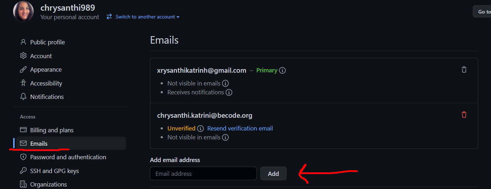
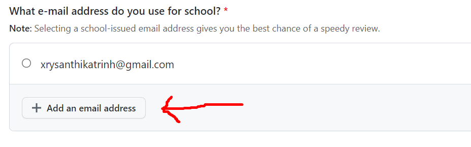
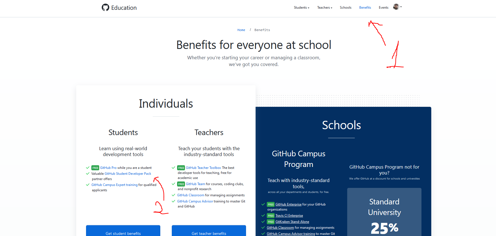
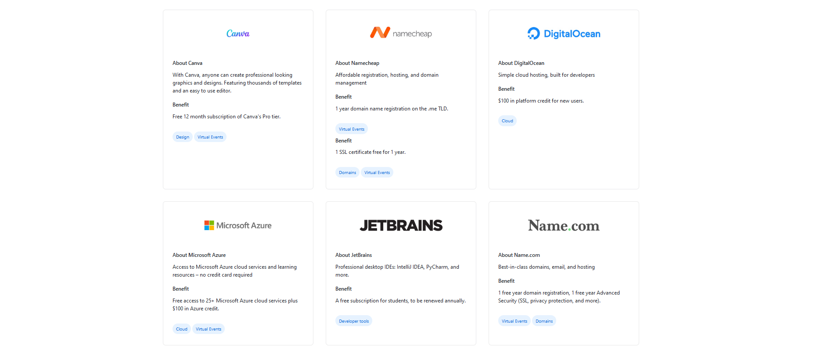

# Github Student Developer Pack

### Step 1

Have an active Github account.

### Step 2

Add in your Github profile the BeCode alias you have received from BeCode (you can find that in your profile in mybecode, it looks like "yourname@becode.xyz").

Note : Make sure you verify your email address. You can find the email in the email address you have declared in the typeform when you joined BeCode (you can find also that email address in your profile in mybecode)

### Step 3

Go to [Github Education](https://education.github.com/pack/join)

### Step 4

Fill in the details asked BUT pay attention to choose and/or add the BeCode alias.

### Step 5

You are in! Now click as the image shows to see your benefits.

Sneak peek:

# ENJOY !