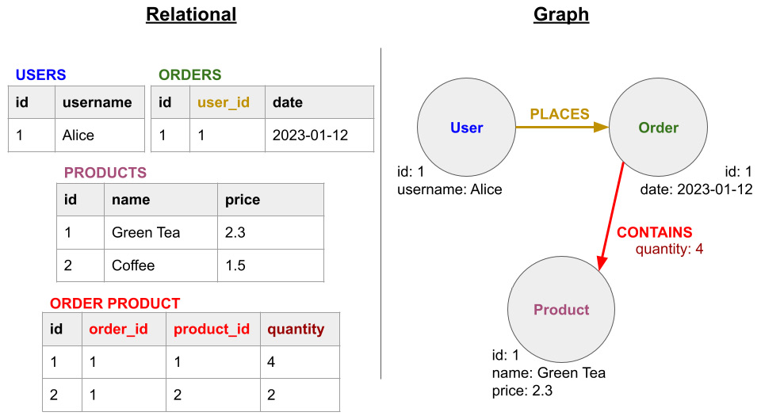

# Graph databases

A graph database is a specialized NoSQL database designed for storing and querying data that is connected via defined relationships. 

In the graph world, the connections between data are as important, if not more, than individual data points.

In a graph database, the information is stored just like you might sketch ideas on a white-board. 
* The data points are stored and displayed through **nodes** and **relationships** instead of tables, or documents. 
* You can find and visualize connections on the data and provides some computational advantanges beause it could facilitate the queries.

For example, given the people (nodes) and their relationships (edges), you can find out who the "friends of friends" of a particular person are (i.e. the friends of Howard's friends). 

 </img>

## What is a graph?

A **Graph** is a non-linear data structure consisting of nodes and edges. It can have a more complicated [mathematical definition](https://en.wikipedia.org/wiki/Graph_(discrete_mathematics)) but for us it will be useful to understand the concept in the context of data. 

Observe the following image of about e-commerce sales. 

 </img>
Source: [Graph Data Science with Neo4j](https://learning.oreilly.com/library/view/graph-data-science/9781804612743/)

If we were to use a relational database, we would need multiple tables to store an user's order information. 

If we look at the graph model, our data is more intuitive to understand. 

These are examples of **property graphs**.
 * They contain nodes (data entities) and relationships (data connections).
* Nodes can contain properties (i.e., key-value pairs).
* Nodes can be labeled with one or more labels.
* Relationships have both names and directions.
* Relationships always have a start node and an end node.
* Like nodes, relationships can also contain properties.

## Main advantages

### Flexible Data Modeling

Graph databases allow for dynamic and fluid data modeling. 
You can easily add or remove nodes and relationships as your data evolves, without having to worry about altering your database schema. 

### Efficient Querying

Graph databases can quickly traverse relationships between nodes to retrieve data. You can easily query for patterns and relationships without having to perform expensive joins or subqueries.

 Take a look at this benchmark of Neo4j running a friends-of-friends query, compared to a traditional relational database (like MySQL):

 

### Scalability
 
Graph databases can easily scale horizontally across multiple servers. As your data grows, you can simply add more servers to your graph database cluster to handle the increased load. 

They can also handle high read and write loads, making them ideal for applications that require real-time data processing.

###  Real-Time Insights

With graph databases, you can quickly identify and respond to changes in your data, without having to wait for batch processing jobs to complete. This makes graph databases ideal for applications that require real-time insights, such as fraud detection systems and recommendation engines.

## Popular Graph Databases

### Neo4J
[Neo4J](https://neo4j.com/) is currently the most popular graph database on the market. It is open source and provides great performance along with the very productive Cypher query language to make working with your data easy. 

Neo4J offers cloud and self-hosted enterprise versions of their database in addition to their open source product. They also have a tight integration with the data science ecosystem and provide a data science platform that allows you to build custom models or use 65 pre-built algorithms and models to get insights into your data.

**Try it yourself!**

You can follow these two examples on how to interact with Neo4j through Python.

- [Create a graph database in Neo4j using Python](https://towardsdatascience.com/create-a-graph-database-in-neo4j-using-python-4172d40f89c4)
- [Build applications with Neo4j and Python
](https://neo4j.com/docs/python-manual/current/)

### TigerGraph

[TigerGraph](https://www.tigergraph.com/) is a proprietary graph database provided by a company of the same name. TigerGraph has built-in support for creating visualizations, doing common tasks related to working with graph data, and also has features for common data science tasks. 

### AWS Neptune

[AWS Neptune](https://aws.amazon.com/neptune/) is a hosted graph database provided by Amazon Web Services It supports both types of graph data models, property and RDF. It automatically provides read replicas, backups, and replication across data centers. For querying Neptune supports Gremlin and SPARQL.

## Resources
 - [Neo4j Sandbox](https://neo4j.com/sandbox/)
- [Neo4j - Overview](https://www.tutorialspoint.com/neo4j/neo4j_overview.htm)
- [Graph Databases for Beginners: Wait, What Do You Mean by “Graph”?](https://neo4j.com/blog/graph-databases-for-beginners-wait-what-do-you-mean-by-graph/)
- [Neo4j Graph Academy](https://neo4j.com/graphacademy/)