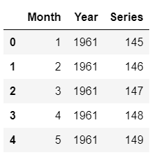

# Time series Forecasting tutorial

## Introduction


 Time series data is data collected on the same subject at different points in time, such as GDP of a country by year, a stock price of a particular company over a period of time, or your own heartbeat recorded at each second. Any data that you can capture continuously at different time-intervals is a form of time series data.


Below is an example of time series data showing the number of COVID-19 cases in the United States as reported to CDC. The x-axis shows the passing of time and the y-axis represents the number of COVID-19 cases in thousands.


 On the other hand, more conventional datasets which store information at a single point in time, such as information on customers, products, and companies, etc., are known as cross-sectional data. An example of this is shown in the dataset below, tracking countries with the most COVID-19 cases in a fixed and consistent time period for all countries.


 It is not very hard to distinguish the difference between cross-sectional and time-series data as the objectives of analysis for both datasets are widely different. In our examples, we were first interested in tracking COVID-19 cases over a period of time, before analyzing COVID-19 cases by country in a fixed time period.


 A typical real-world dataset is likely to be a hybrid of these formats. For example, we could think of a retailer like Walmart that sells thousands of products every day. If you analyze the sales by product on a particular day, this will be a cross-sectional analysis. You could want to find out what the number 1 selling item on Christmas Eve is for example. Comparatively, if you wanted to find out the sale of one particular item over a period of time (let's say last 5 years), this would be a time-series analysis.


 The objectives are different when analyzing time-series and cross-sectional data, and a real-world dataset is likely to be a hybrid of both time-series as well as cross-sectional data.

## Learning Objectives

 In this tutorial you will learn:


* [What is Time Series forecasting?](#what-is-time-series-forecasting-)
* [Type of Time Series Forecasting?](#type-of-time-series-forecasting) 
	+ [Univariate Forecast](#univariate-forecast)
	+ [Multivariate Forecast](#multivariate-forecast)
* [Time Series Forecasting Method](#time-series-forecasting-methods)
* [Statistical Models](#statistical-models) 
	+ [ARIMA](#arima)
	+ [SARIMA](#sarima)
	+ [Exponential Smoothing](#exponential-smoothing)
	+ [TBATS](#tbats)
* [Machine Learning](#machine-learning)
* [Python Frameworks for Forecasting](#python-frameworks-for-forecasting) 
	+ [Facebook Prophet](#facebook-prophet)
	+ [sktime](#sktime)
	+ [pmdarima](#pmdarima)
	+ [Kats](#kats)
	+ [Orbit](#orbit)
	+ [PyCaret](#pycaret)
* [An end-to-end example using PyCaret](#end-to-end-example) 
	+ [The Dataset](#dataset)
	+ [Setup Experiment](#setup-experiment)
	+ [Exploratory Data Analysis](#exploratory-data-analysis-eda-)
	+ [Model Analysis](#model-analysis)
	+ [Model Deployment](#model-deployment)
* [Learn more about PyCaret](#learn-more-about-pycaret)
* [Conclusion](#conclusion)

## What is Time Series Forecasting?


 Time series forecasting is exactly what it sounds like; predicting unknown values. Time series forecasting involves the collection of historical data, preparing it for algorithms to consume, and then predicting the future values based on patterns learned from the historical data.


 There are numerous reasons why companies may be interested in forecasting future values, namely GDP, monthly sales, inventory, unemployment, and global temperatures:


* A retailer may be interested in predicting future sales at an SKU (stock keeping unit) level for planning and budgeting.
* A small merchant may be interested in forecasting sales by store, so it can schedule the right resources (more people during busy periods and vice versa).
* A software giant like Google may be interested in knowing the busiest hour of the day or busiest day of the week so that they can schedule server resources accordingly.
* The health department may be interested in predicting the cumulative COVID vaccinations administered so that they can further predict when herd immunity is expected to kick in.


## Type of Time Series Forecasting


 There are three types of time series forecasting. Which one you should use depends on the type of data you are dealing with and the use-case in hand:


### Univariate Forecast


 A univariate time series, as the name suggests, is a series with a single time-dependent variable. For example, if you are tracking hourly temperature values for a given region and want to forecast the future temperature using historical temperatures, this is univariate time series forecasting. Your data may look like this:


### Multivariate Forecast


 On the other hand, a Multivariate time series has more than one time-dependent variable. Each variable depends not only on its past values but also has some dependency on other variables. This dependency is used for forecasting future values.


 Consider the above example and suppose that our dataset includes other weather-related attributes over the same time period, such as perspiration percent, dew point, wind speed, etc., along with the temperature values. In this case, there are multiple variables to be considered to optimally predict temperature. A series like this would fall under the category of multivariate time series. Your dataset will look like this now:


 You are still forecasting temperature values for the future but now you can use other available information in your forecast as we assume temperature values will be dependent on these factors as well.


 Image Source: Van Nguyen


 When we are dealing with multivariate time series forecasting, the input variables can be of two types:


* Exogenous: Input variables that are not influenced by other input variables and on which the output variable depends.
* Endogenous: Input variables that are influenced by other input variables and on which the output variable depends.


 This tutorial will discuss several classical models but not all of them support multivariate time series forecasting. In situations like these, machine learning models come to the rescue as you can model any time series forecasting problem with regression. We will see an example of this later in this tutorial.


## Time Series Forecasting Methods


 Time series forecasting can broadly be categorized into the following categories:


* Classical / Statistical Models — Moving Averages, Exponential Smoothing, ARIMA, SARIMA, TBATS
* Machine Learning — Linear Regression, XGBoost, Random Forest, or any ML model with reduction methods
* Deep Learning — RNN, LSTM


 This tutorial is focused on the first two methods: classical/statistical models and machine learning. Deep learning methods are out-of-scope for this tutorial.


## Statistical Models


 When it comes to time series forecasting using statistical models, there are quite a few popular and well-accepted algorithms. Each of them has different mathematical modalities and they come with a different set of assumptions that must be satisfied. This tutorial will not go in-depth on the mathematical concepts, rather will just give an intuition that you will hopefully find helpful.


### ARIMA


 ARIMA is one of the most popular classical methods for time series forecasting. It stands for autoregressive integrated moving average and is a type of model that forecasts given time series based on its own past values, that is, its own lags and the lagged forecast errors. ARIMA consists of three components:


* Autoregression (AR): refers to a model that shows a changing variable that regresses on its own lagged, or prior, values.
* Integrated (I): represents the differencing of raw observations to allow for the time series to become stationary (i.e., data values are replaced by the difference between the data values and the previous values).
* Moving average (MA): incorporates the dependency between an observation and a residual error from a moving average model applied to lagged observations.


 The "AR" part of
 [ARIMA](https://www.sktime.org/en/v0.8.0/api_reference/auto_generated/sktime.forecasting.arima.ARIMA.html) 
 indicates that the evolving variable of interest is regressed on its own lagged (i.e., prior observed) values. The "MA" part indicates that the regression error is actually a linear combination of error terms whose values occurred contemporaneously and at various times in the past. The "I" (for "integrated") indicates that the data values have been replaced with the difference between their values and the previous values (and this differencing process may have been performed more than once). The purpose of each of these features is to make the model fit the data as well as possible.


### SARIMA


 An extension to ARIMA that supports the direct modeling of the seasonal component of the series is called SARIMA. A problem with the ARIMA model is that it does not support seasonal data. That is a time series with a repeating cycle. ARIMA expects data that is either not seasonal or has the seasonal component removed, e.g. seasonally adjusted via methods such as seasonal differencing. SARIMA adds three new hyperparameters to specify the autoregression (AR), differencing (I), and moving average (MA) for the seasonal component of the series.


 Forecast using SARIMA model


### Exponential Smoothing


 Exponential smoothing is a time series forecasting method for univariate data. It can be extended to support data with a trend or seasonal component. It can be used as an alternative to the popular ARIMA family of models.


 Exponential smoothing of time series data assigns exponentially decreasing weights for newest to oldest observations. The older the data, the less weight the data is given, whereas newer data is given more weight


* vSimple (single) exponential smoothing uses a weighted moving average with exponentially decreasing weights.
* Holt's exponential smoothing is usually more reliable for handling data that shows trends.
* Triple exponential smoothing (also called the Multiplicative Holt-Winters) is more reliable for parabolic trends or data that shows trends and seasonality.


[comparison results between a single exponential smoothing (ES), double ES, and two-stage EWMA](https://www.researchgate.net/figure/Comparison-results-between-a-single-exponential-smoothing-ES-double-ES-and-two-stage_fig3_346318470) 


### TBATS


[TBATS](https://www.sktime.org/en/v0.8.1/api_reference/auto_generated/sktime.forecasting.tbats.TBATS.html) 
 models are for time series data with multiple seasonality. For example, retail sales data may have a daily pattern and weekly pattern, as well as an annual pattern.


 In TBATS, a Box-Cox transformation is applied to the original time series, and then this is modeled as a linear combination of an exponentially smoothed trend, a seasonal component, and an ARMA component.


 Forecast using TBATS


## Machine Learning


 If you don't want to use statistical models or they are not performing well, you can try this method. Machine learning is an alternative way of modeling time-series data for forecasting. In this method, we extract features from the date to add to our "X variable" and the value of the time-series is "y variable". Let's see an example:


 For the purpose of this tutorial, I have used the US airline passengers dataset available to download from
 [Kaggle](https://www.kaggle.com/chirag19/air-passengers) 
 .


 Dataset Sample


 We can extract features from the "Date" column such as a month, year, week of the year, etc. See example:


```python
# extract month and year from dates
data['Month'] = [i.month for i in data['Date']]
data['Year'] = [i.year for i in data['Date']]
```


### create a sequence of numbers


```python
data['Series'] = np.arange(1,len(data)+1)
```


### drop unnecessary columns and re-arrange


```python 
data.drop(['Date', 'MA12'], axis=1, inplace=True)
data = data[['Series', 'Year', 'Month', 'Passengers']]
```


### check the head of the dataset


```python 
data.head()
```


 Sample rows after extracting features


 Something to note here is that the train-test-split for time-series data is special. Because you cannot change the order of the table, you have to ensure that you don't sample randomly as you want your test data to contain points that are in the future from the points in the train data (time always moves forward).


```python 
# split data into train-test set
train = data[data['Year'] < 1960]
test = data[data['Year'] >= 1960]
```


### check shape


```python
train.shape, test.shape
```

> ((132, 4), (12, 4))`


 Now that we have done the train-test-split, we are ready to train a machine learning model on the train data, score it on the test data and evaluate the performance of our model. In this example, I will use PyCaret; an open-source, low-code machine learning library in Python that automates machine learning workflows. To use PyCaret, you have to install it using pip.


```python
# install pycaret
pip install --pre pycaret
``` 


 If you need any help during installation, please refer to the official documentation.


 Assuming you have installed PyCaret successfully:

```python
# import the regression module
from pycaret.regression import *
```


### initialize setup


 ```python
 s = setup(data = train, test\_data = test, target = 'Passengers', fold\_strategy = 'timeseries', numeric\_features = ['Year', 'Series'], fold = 3, transform\_target = True, session\_id = 123)
 ```

Now to train machine learning models, you just need to run one line:


```python
best = compare_models(sort = 'MAE')
``` 


 Output from compare\_models


 The best model using 3 fold cross-validation based on Mean Absolute Error (MAE) is Leased Angle Regression. We can now use this model to forecast the future. For that, we have to create "X variables" in the future. This can be done by creating future dates and then extracting features from them.


 Since we have trained our model on the data until 1960, let's predict five years out in the future through 1965. To use our final model to generate future predictions, we first need to create a dataset consisting of the Month, Year, Series column on the future dates. This code below creates the future "X" dataset.


```python
future_dates = pd.date_range(start = '1961-01-01', end = '1965-01-01', freq = 'MS')
future_df = pd.DataFrame()
future_df['Month'] = [i.month for i in future_dates]
future_df['Year'] = [i.year for i in future_dates] 
future_df['Series'] = np.arange(145,(145+len(future_dates)))
future_df.head()
```



 Sample rows from future\_df


 Now we can use future\_df to make predictions:


```python
predictions_future = predict_model(best, data=future_df)
predictions_future.head()
```


 Output from predictions\_future.head()


 And now we can plot it:


```python
concat_df = pd.concat([data,predictions_future], axis=0)
concat_df_i = pd.date_range(start='1949-01-01', end = '1965-01-01', freq = 'MS')
concat_df.set_index(concat_df_i, inplace=True)
fig = px.line(concat_df, x=concat_df.index, y=["Passengers", "Label"], template = 'plotly_dark')
fig.show()
```


 Actual (1949–1960) and Predicted (1961–1964) US airline passengers


 There are a few important elements to note here. Whenever you are dealing with univariate time series you can always convert them into regression problems and solve them as in this example. However, you have to be careful about cross-validation. You cannot do random cross-validation on time-series models and you must use time-series appropriate techniques.In this example, PyCaret uses
 [TimeSeriesSplit](https://scikit-learn.org/stable/modules/classes.html#module-sklearn.model_selection) 
 from the scikit-learn library.
 
### A note on Pandas Series
 
 When it comes to Time series, you want to be mindful of the type of data structure you use with Pandas: a Dataframe, like in the above example, or a Series. Series have additional methods that are not applicable to Dataframes for instance. Consult the [Pandas documentation](https://pandas.pydata.org/docs/user_guide/dsintro.html) for more information.


## Python Frameworks for Forecasting


### Facebook Prophet


**Prophet is open-source software released by Facebook's Core Data Science team. It is available for download on CRAN and PyPI.** 


 Prophet is a procedure for forecasting time series data based on an additive model where non-linear trends are fit with yearly, weekly, and daily seasonality, plus holiday effects. It works best with time series that have strong seasonal effects and several seasons of historical data. Prophet is robust to missing data and shifts in the trend, and typically handles outliers well.


 To learn more about it, check out this
 [link](https://facebook.github.io/prophet/docs/quick_start.html#python-api) 
 .


 Forecast using FB Prophet


### sktime


 sktime is an open-source, unified framework for machine learning with time series. It provides an easy-to-use, flexible and modular platform for a wide range of time series machine learning tasks. It offers scikit-learn compatible interfaces and model composition tools, with the goal to make the ecosystem more usable and interoperable as a whole.


 To learn more about sktime, check out this
 [link](https://www.sktime.org/en/stable/examples/01_forecasting.html) 
 .


### pmdarima


 Pmdarima is a statistical library designed to fill the void in Python's time series analysis capabilities. This includes:


* The equivalent of R's auto.arima functionality
* A collection of statistical tests of stationarity and seasonality
* Seasonal time series decompositions
* Cross-validation utilities
* A rich collection of built-in time series datasets for prototyping and examples


 To learn more about pmdarima, check out
 [this page](https://github.com/alkaline-ml/pmdarima) 
 .


### Kats


 Kats is another amazing open-source project by Facebook, released by their Infrastructure Data Science team. It is available for download on PyPI.


 Kats is a toolkit to analyze time-series data; a lightweight, easy-to-use, and generalizable framework to perform time series analysis. Kats aims to provide a one-stop shop for time series analysis, including detection, forecasting, feature extraction/embedding, and multivariate analysis, etc.


 Forecast using KATS


 To learn more about KATS, check out
 [this link](https://github.com/facebookresearch/Kats) 
 .


### Orbit


 Orbit is an amazing open-source project by Uber. It is a Python library for Bayesian time series forecasting. It provides a familiar and intuitive initialize-fit-predict interface for time series tasks, while utilizing probabilistic programming languages under the hood.


 Forecast using Orbit


 To learn more about Orbit, check out this
 [link](https://github.com/uber/orbit) 
 .


### PyCaret


 PyCaret is an open-source, low-code machine learning library in Python that automates machine learning workflows. With PyCaret, you spend less time coding and more time on analysis. You can train your model, analyze it, iterate faster than ever before, and deploy it instantaneously as a REST API or even build a simple front-end ML app, all from your favorite Notebook.


 PyCaret Time Series Module Architecture. Developed by Lead Developer Nikhil Gupta.


 Next, we will see an example of an end-to-end time-series forecasting task using PyCaret library.


## Conclusion


 Time-series forecasting is a very useful skill to learn. Many real-life problems are time-series in nature. Forecasting has a range of applications in various industries, with tons of practical applications including: weather forecasting, economic forecasting, healthcare forecasting, financial forecasting, retail forecasting, business forecasting, environmental studies, social studies, and more.


 Basically, any historical data with consistent intervals can be analyzed with time series analysis methods leading into a forecasting task that learns from the historical data and tries to predict the future. To conclude, there are three broad categories for time series forecasting:


* Statistical Models - Exponential smoothing, ARIMA, SARIMA, TBATS, etc.
* Machine Learning -Linear Regression, XGBoost, Random Forest, etc.
* Deep Learning - RNN, LSTM


[Adapted from this blog post from Datacamp](https://www.datacamp.com/tutorial/tutorial-time-series-forecasting) 


