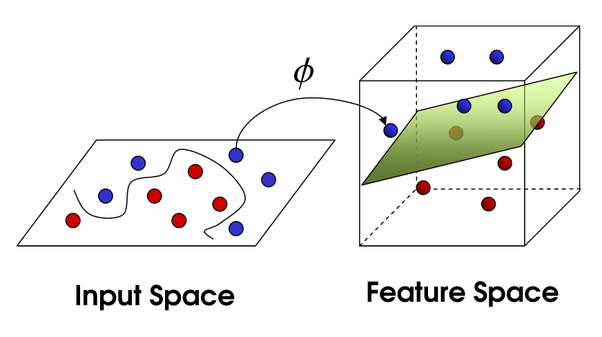
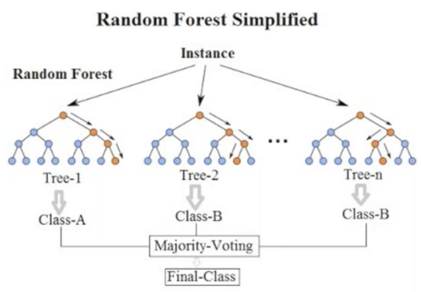

# Supervised Learning 

## What is it ? 
 

Supervised learning, also known as supervised machine learning, is a subcategory of machine learning and artificial intelligence. It is defined by its use of labeled datasets to train algorithms that classify data or predict outcomes accurately. As input data is fed into the model, it adjusts its weights until the model has been fitted appropriately.

Supervised learning uses a training set to teach models to yield the desired output. This training dataset includes inputs and correct outputs, which allow the model to learn over time. The algorithm measures its accuracy through the loss function, adjusting until the error has been sufficiently minimized.

Supervised learning can be separated into two types of problems, classification and regression:

- Classification uses an algorithm to accurately assign test data into specific categories. It recognizes specific entities within the dataset and attempts to draw some conclusions on how those entities should be labeled or defined. Common classification algorithms are linear classifiers, support vector machines (SVM), decision trees, k-nearest neighbor, and random forest, which are described in more detail below.

- Regression is used to understand the relationship between dependent and independent variables. It is commonly used to make projections, such as for sales revenue for a given business. Linear regression, logistical regression, and polynomial regression are popular regression algorithms.

In the real-world, supervised learning can be used for Risk Assessment, Image classification, Fraud Detection, spam filtering, etc.

### Common algorithms

Various algorithms and computations techniques are used in supervised machine learning processes. Below are brief explanations of some of the most commonly used learning methods, typically calculated through use of programs like R or Python:

- **Neural networks**: Primarily leveraged for deep learning algorithms, neural networks process training data by mimicking the interconnectivity of the human brain through layers of nodes. Each node is made up of inputs, weights, a bias (or threshold), and an output. If that output value exceeds a given threshold, it “fires” or activates the node, passing data to the next layer in the network. Neural networks learn this mapping function through supervised learning, adjusting based on the loss function through the process of gradient descent. When the cost function is at or near zero, we can be confident in the model’s accuracy to yield the correct answer.

- **Naive bayes**: Naive Bayes is classification approach that adopts the principle of class conditional independence from the Bayes Theorem. This means that the presence of one feature does not impact the presence of another in the probability of a given outcome, and each predictor has an equal effect on that result. There are three types of Naïve Bayes classifiers: Multinomial Naïve Bayes, Bernoulli Naïve Bayes, and Gaussian Naïve Bayes. This technique is primarily used in text classification, spam identification, and recommendation systems.

- **Linear regression** : Linear regression is used to identify the relationship between a dependent variable and one or more independent variables and is typically leveraged to make predictions about future outcomes. When there is only one independent variable and one dependent variable, it is known as simple linear regression. As the number of independent variables increases, it is referred to as multiple linear regression. For each type of linear regression, it seeks to plot a line of best fit, which is calculated through the method of least squares. However, unlike other regression models, this line is straight when plotted on a graph.

- **Logistic regression**: While linear regression is leveraged when dependent variables are continuous, logistic regression is selected when the dependent variable is categorical, meaning they have binary outputs, such as "true" and "false" or "yes" and "no." While both regression models seek to understand relationships between data inputs, logistic regression is mainly used to solve binary classification problems, such as spam identification.

- **Support vector machines (SVM)**: A support vector machine is a popular supervised learning model developed by Vladimir Vapnik, used for both data classification and regression. That said, it is typically leveraged for classification problems, constructing a hyperplane where the distance between two classes of data points is at its maximum. This hyperplane is known as the decision boundary, separating the classes of data points (e.g., oranges vs. apples) on either side of the plane.

- **K-nearest neighbor**: K-nearest neighbor, also known as the KNN algorithm, is a non-parametric algorithm that classifies data points based on their proximity and association to other available data. This algorithm assumes that similar data points can be found near each other. As a result, it seeks to calculate the distance between data points, usually through Euclidean distance, and then it assigns a category based on the most frequent category or average. Its ease of use and low calculation time make it a preferred algorithm by data scientists, but as the test dataset grows, the processing time lengthens, making it less appealing for classification tasks. KNN is typically used for recommendation engines and image recognition.

- **Random forest**: Random forest is another flexible supervised machine learning algorithm used for both classification and regression purposes. The "forest" references a collection of uncorrelated decision trees, which are then merged together to reduce variance and create more accurate data predictions.

[Source : IBM   ](https://www.ibm.com/topics/supervised-learning#:~:text=Supervised%20learning%20uses%20a%20training,error%20has%20been%20sufficiently%20minimized.)

## Some drills and more theory ?

Don't hesitate to go back to the previous chapter about  [classification](../../1.intro/Structured_data/2.Classification/README.md)  and [regression](../../1.intro/Structured_data/1.Regression/readme.md)

## Choose a project to practice your skills on a classification task

Choose one classification task from the list below that you find interesting and submit your work (notebook) to the coaches if you want. Compare your model metrics to your colleagues results.

- [animal condition classification](projects/animals/animal_condition.ipynb)
- [drug classification](projects/drugs/drugs_classification.ipynb)
- [glass](projects/glass/glass_classification.ipynb)
- [waste classification (images)](projects/waste/waste_classification.ipynb)

If you find another classification project that you want to try, don't hesitate to tell the coaches.

When you're done with a project, don't hesitate to put your score on the [score board](https://docs.google.com/spreadsheets/d/14m1uHQWorVB9wSeGcoFG-8GOMNUGOdeNKuEsuxPMQBY/edit?usp=sharing)

